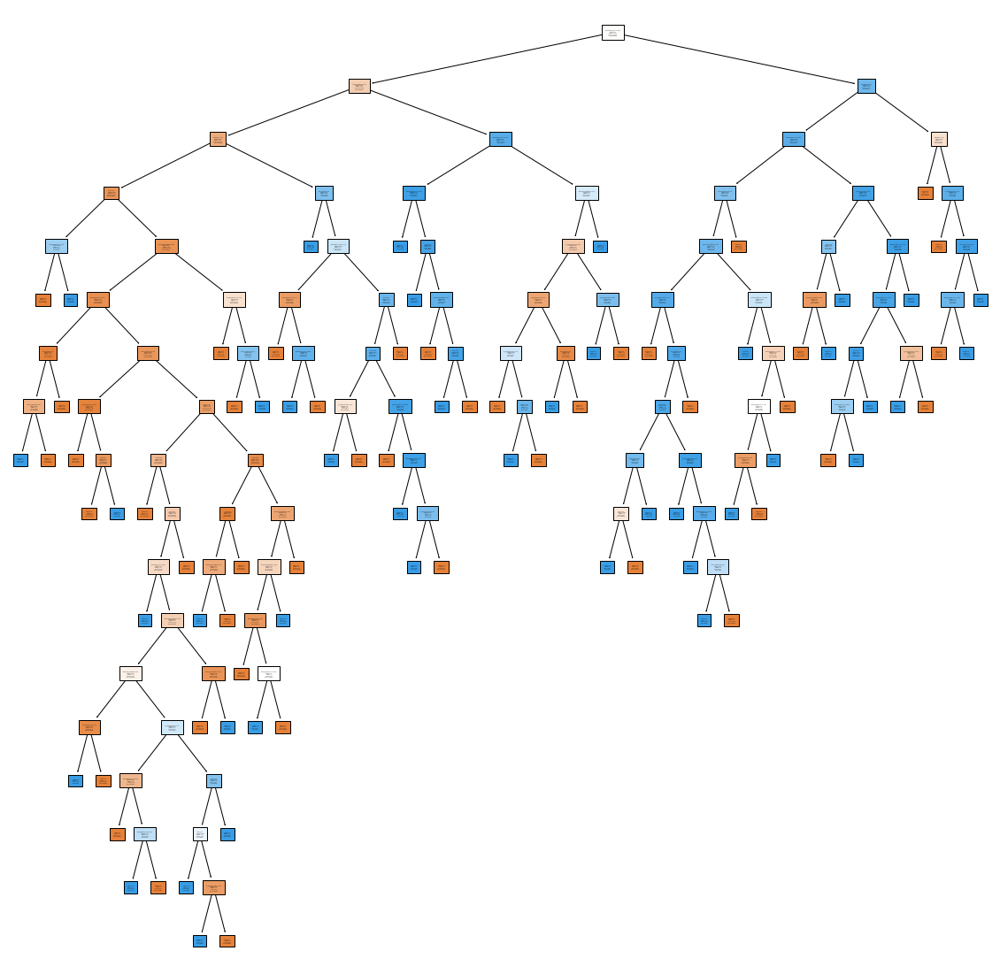
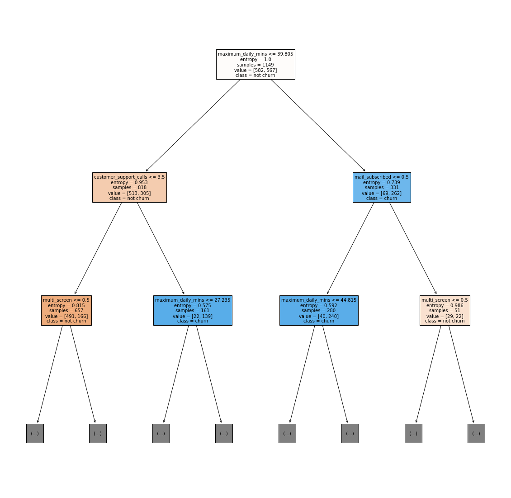

# Customer_churn_prediction
Predicting customer churn using logistic regression and Decision tree classifier

## Introduction

This project focuses on predicting customer churn for a video streaming service company. The aim is to determine whether a customer will renew their subscription for the coming year or not. The dataset consists of around 2000 rows and 16 columns and the project involves the following steps:

* Inspecting and cleaning up the data
* Perform data encoding on categorical variables
* Exploratory Data Analysis (EDA)
* Data Visualization
* Feature Engineering
* Model Building
* Model Validation (predictions)
* Handling the unbalanced data
* Feature Selection
* Feature Importance

## Feature Engineering

In the feature engineering step, unwanted columns were dropped from the dataset.

## Handling the Unbalanced Data

The dataset was unbalanced, with a larger number of positive samples than negative samples. To handle this, several techniques were used, including:

* Using balanced weights
* Using random weights
* Adjusting the imbalanced data
* Using SMOTE

## Feature Selection

The Recursive Feature Elimination (RFE) method was used for feature selection.

## Feature Importance

A function was created to find the most important features in the dataset. The features were then plotted to visualize their importance.

## Model Building

The project involves the building of two models: Logistic Regression Model and Decision Tree Model. The dataset was divided into training and testing sets, with 80% of the data being used for training and 20% for testing.

## Model Validation (predictions)

The models were evaluated using several evaluation metrics, including:

* Accuracy score
* Confusion matrix
* ROC and AUC
* Recall score
* Precision score
* F1-score

## Evaluation Metrics

The logistic regression model achieved an AUC of 0.75, and the decision tree model achieved an AUC of 0.95. The precision, recall, and f1-score for both models were also calculated and are provided in the evaluation metrics section above.

## Decision Tree structure

